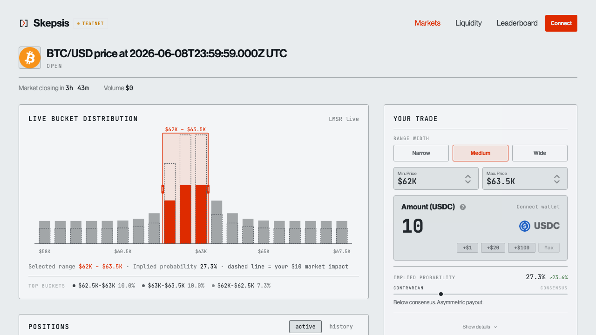
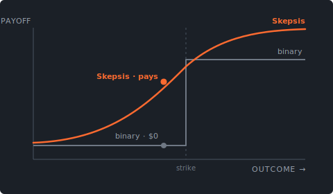
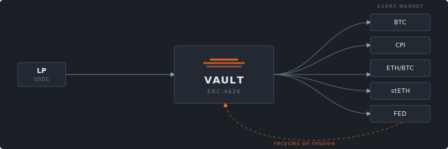

# Skepsis — core contracts

[Website](https://skepsis.live) · [App](https://alpha.skepsis.live) · [Docs](https://docs.skepsis.live) · [X](https://x.com/skepsis_market) · [Telegram](https://t.me/skepsis_market)

Skepsis is a continuous-outcome prediction market protocol on EVM. Where a binary market prices *direction* (will a value cross a line, yes or no), Skepsis prices *magnitude*: a trader takes a position on the range a value will land in, and the payoff scales with how tight that range is. Pricing is automatic via LMSR (Logarithmic Market Scoring Rule) over a bucketed value axis, so every range is quotable without an order book or a counterparty.

This repository contains the Solidity contracts: market, pricing math, liquidity vault, positions, routing, and resolution. It targets Arbitrum and settles in USDC.



---

## Overview

A market divides a numerical outcome (a price, rate, ratio, or other Chainlink-readable value) into fixed-width **buckets**. A trader selects a contiguous range of buckets and buys shares; if the resolution value lands in any owned bucket, each share redeems for $1 of USDC. LMSR sets the price of every bucket continuously: buying a range raises its price and lowers the rest, while keeping the implied distribution coherent and the maximum payout bounded.



Three properties drive the design:

- **Continuous payoff.** One position prices a whole range. The trader who modeled the level is paid more than the one who only guessed the direction.
- **Shared liquidity.** A single ERC-4626 vault seeds every market and recovers capital on resolution, so a new market is tradable immediately and LPs earn across the whole book.
- **Bounded LP risk.** LMSR over-collateralizes (the pool always holds at least the maximum payout), and the liquidity parameter `alpha` caps worst-case LP loss.

---

## Architecture

```
                    creates EIP-1167 clones
   MarketFactory ───────────────────────────►  LMSRMarket  (one per market)
        │                                          │
        │ pulls seed liquidity                      │ pricing math
        ▼                                          ▼
      Vault  ◄──── surplus harvested ────────   BucketTree   (lazy segment tree, O(log N))
   (ERC-4626)      on resolution                LMSRCost     (cost function)
                                                FixedPointMath (exp / ln, PRBMath)

   TradeRouter ──── buy / sell / claim ────►  LMSRMarket  ────► PositionNFT (ERC-1155)
   (user entry, slippage + deadline)

   ChainlinkPriceOracleResolver ──── resolve(value) ────►  LMSRMarket
   (round-bracketed Chainlink feed, time-gated)
```

| Contract | Responsibility |
|---|---|
| `LMSRMarket.sol` | Core market. Pricing, range trading, alpha decay, resolution, claims, solvency. Deployed as a minimal-proxy clone per market. |
| `BucketTree.sol` | Sparse lazy segment tree. Collapses an N-bucket range trade to ~O(log N) operations instead of N. |
| `LMSRCost.sol` | Pure LMSR cost-function math (`C = alpha · ln(Σ exp(qᵢ/alpha))`). |
| `FixedPointMath.sol` | Fixed-point `exp` / `ln` (wraps PRBMath) for the cost function. |
| `Vault.sol` | ERC-4626 LP vault. Seeds markets, harvests resolved capital, enforces a single-market exposure cap, and serves exits through a withdrawal queue. |
| `MarketFactory.sol` | EIP-1167 clone factory. Curated, creator-allowance gated. Wires each market to the vault, router, and position token. |
| `TradeRouter.sol` | User-facing entry point for buy, sell, and claim. Handles USDC and position-token transfers, slippage bounds, and deadlines. Pausable. |
| `PositionNFT.sol` | ERC-1155 positions. Token id encodes `(marketId << 128) \| (rangeLower << 64) \| rangeUpper`. |
| `ChainlinkPriceOracleResolver.sol` | Resolves price markets from a Chainlink feed by pinning the round that brackets the scheduled resolution time. |

---

## Core mechanisms

### LMSR pricing over a bucket tree

An order book over a numerical range needs a resting quote on every bucket; thin markets leave gaps. LMSR is a single automated maker over the entire range: there is always a price, depth is shared across every bucket, and the cost of any trade is the difference in the cost function before and after. A naïve range trade evaluates `exp()` per bucket; `BucketTree` applies the same delta to a whole range with lazy propagation, so a 50-bucket trade costs roughly the same gas as a 5-bucket trade.

### The vault (ERC-4626)

`Vault.sol` is the protocol's liquidity layer. LPs deposit USDC and receive shares; the share price tracks realized market-making P&L across all markets.

- **Seeding.** When the factory creates a market it calls `fundNewMarket`, and the vault deploys seed liquidity so the market is tradable on creation. `maxMarketBps` caps how much of net assets any single market may hold.
- **Harvest.** On resolution the market returns its residual pool balance to the vault. Over-collateralization means the pool always covered the maximum payout; the surplus over claims is LP yield.
- **Withdrawal queue.** Because capital is deployed into live markets, instant withdrawals are limited to the liquid buffer. Larger exits use a Lido-style queue: shares burn at request, and the claim is honored as capital frees up. There is no cancellation, which keeps share accounting unambiguous.
- **Gating.** `setDepositsEnabled` and OpenZeppelin `Pausable` gate deposits and withdrawals for controlled rollout; the owner is always permitted to seed.



### Alpha decay

`alpha` is the LMSR liquidity parameter: high alpha means deep liquidity and small price impact, low alpha means a shallower book and larger impact. A market can be configured to **decay alpha linearly from `alphaInitial` to `alphaFinal`** over `decayDuration` (`alphaFinal` is floored at 10% of `alphaInitial`). The book starts deep and tightens toward resolution.

This is **sniper defense**. Near resolution, late information is most valuable; a shallow book at that point means an informed trader cannot size up cheaply against LPs. Decay is checkpointed per epoch so reads stay cheap, and a market with `decayDuration == 0` runs at constant alpha.

### Resolution and settlement

`ChainlinkPriceOracleResolver` registers a market against a specific Chainlink feed, divisor, and staleness threshold (a curated, allowance-gated step). At the scheduled resolution time it pins the feed round that brackets that timestamp, verifies it on-chain, and submits the value. The market maps the value to the winning bucket. Resolution is numerical and time-gated — no semantic interpretation.

Settlement is over-collateralized: the pool holds at least the maximum payout at all times, winners `claim` $1 per winning share through the `TradeRouter`, and the residual is harvested back to the vault. Worst-case LP loss is bounded by alpha.

### Positions

Positions are ERC-1155 tokens held in the trader's wallet, so they are composable with other protocols. The token id encodes the market and the exact bucket range, which lets the protocol key positions deterministically without per-position storage.

---

## Build and test

```sh
# Foundry
curl -L https://foundry.paradigm.xyz | bash && foundryup

forge install
forge build
forge test -vv
```

The suite covers LMSR and fixed-point math, multi-bucket range trades and segment-tree correctness, the full create → trade → resolve → claim lifecycle, solvency invariants (pool always covers max payout), alpha-decay loss bounds, and gas benchmarks across bucket counts.

```sh
forge snapshot          # gas benchmarks
forge test --match-path 'test/**/*Invariant*'
```

## Deployment

```sh
# Arbitrum Sepolia
forge script script/Deploy.s.sol:DeployScript \
  --rpc-url arb_sepolia --broadcast --verify
```

`Deploy.s.sol` deploys `FixedPointMath` → the `LMSRMarket` implementation → `PositionNFT` → `MarketFactory` → `Vault` → `TradeRouter` → `ChainlinkPriceOracleResolver`, wires them together, and seeds the vault. RPC and key are read from the environment (`.env.example`).

## Deployed addresses — Arbitrum Sepolia

```
MARKET_FACTORY      0xF1E02178c1d6f933A601136875dbB3aAe9117105
LMSR_IMPLEMENTATION 0x65Bcc46904dB28F7D571940A11db3DE6bf02A24c
VAULT               0xc4b0F59d9067A033654F9E0318325246297D6b0e
POSITION_NFT        0xBeeF92998F4044e1c53d0707e59eB32887e5c661
TRADE_ROUTER        0x8020497fB3F46E0e842A7617fAD8a4902F0A0ac4
ORACLE_RESOLVER     0x2Fe5b0b134274DF7e1000C9bD8a65C5b47598973
USDC                0x82dB8786B5630F19D8e6C86A697a6d92e6363732
```

## Stack

Solidity 0.8.28 · Foundry · OpenZeppelin · PRBMath · Arbitrum · USDC (6 decimals). Markets are EIP-1167 clones; the build uses `via_ir` with `optimizer_runs = 1` to minimize deployment bytecode.

## Documentation

- [`docs/LMSR_ALGORITHM_BLUEPRINT.md`](docs/LMSR_ALGORITHM_BLUEPRINT.md) — pricing and the bucket tree
- [`docs/LIFECYCLE.md`](docs/LIFECYCLE.md) — market lifecycle, end to end
- [`docs/DECIMAL_HANDLING.md`](docs/DECIMAL_HANDLING.md) — fixed-point and 6-decimal conventions
- [`docs/SOLIDITY_SRS.md`](docs/SOLIDITY_SRS.md) — contract requirements and interfaces
- [`docs/FE_INTEGRATION_GUIDE.md`](docs/FE_INTEGRATION_GUIDE.md) — integration reference

## Security model

Markets are curated, not permissionless: the factory gates creation by creator allowance, and the resolver gates registration the same way. Every market resolves to a number from a named Chainlink feed. The pool is over-collateralized on every trade, and worst-case LP loss is bounded by alpha. The trust model is read-the-code; the contracts are verified on Arbiscan.

## Links

- Website: https://skepsis.live
- App: https://alpha.skepsis.live
- Docs: https://docs.skepsis.live
- X: https://x.com/skepsis_market
- Telegram: https://t.me/skepsis_market
- GitHub: https://github.com/skepsis-market

## License

MIT © 2026 Skepsis. See [LICENSE](LICENSE).
